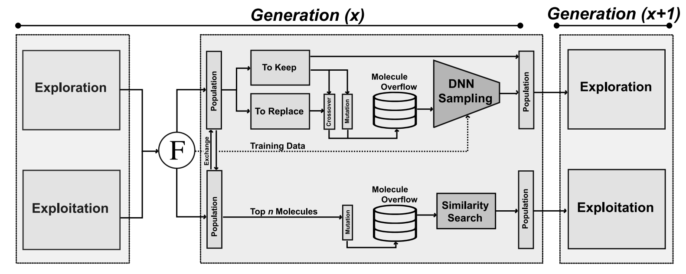

# JANUS: Parallel Tempered Genetic Algorithm Guided by Deep Neural Networks for Inverse Molecular Design
This repository contains code for the paper: [JANUS: Parallel Tempered Genetic Algorithm Guided by Deep Neural Networks for Inverse Molecular Design](https://arxiv.org/abs/2106.04011). 

Originally by: AkshatKumar Nigam, Robert Pollice, Alán Aspuru-Guzik 

Updated by: Gary Tom




## Prerequsites: 

Use [Python 3.7 or up](https://www.python.org/download/releases/3.0/).

You will need to separately install [RDKit](https://www.rdkit.org/docs/Install.html) version >= 2020.03.1. The easiest is to do this on conda.

JANUS uses [SELFIES](https://github.com/aspuru-guzik-group/selfies) version 1.0.3. If you want to use a different version, pip install your desired version; this package will still be compatible. Note that you will have to change your input alphabets to work with other versions of SELFIES.


## Major changes:

- Support the use of any version of SELFIES (please check your installation).
- Improved multiprocessing.
- GPU acceleration of neural networks.
- Early stopping for classifier. 
- Included SMILES filtering option.
- Additional hyperparameters for controlling JANUS. Defaults used in paper are given in `tests` directory.

## How to run: 

Install JANUS using 

```bash
pip install janus-ga
```

Example script of how to use JANUS is found in [tests/example.py](tests/example.py). You can run the file with

```bash
cd tests
python ./example.py
```

Within this file are examples for: 
1. A function for calculting property values (see function `fitness_function`). 
2. Custom filtering of SMILES (see function `custom_filter`).
3. Initializing JANUS from dictionary of parameters.
4. Generating hyperparameters from provided yaml file (see function `janus.utils.from_yaml`).

Important parameters the user should provide:
- `work_dir`: directory for outputting results
- `fitness_function`: fitness function defined for an input smiles that will be maximized
- `start_population`: path to text file of starting smiles one each new line
- `generations`: number if evolution iterations to perform
- `generation_size`: number of molecules in the populations per generation
- `custom_filter`: filter function checked after mutation and crossover, returns `True` for accepted molecules
- `use_fragments`: toggle adding fragments from starting population to mutation alphabet
- `use_classifier`: toggle using classifier for selection bias

See [tests/default_params.yml](tests/default_params.yml) for detailed description of adjustable parameters.


## Outputs: 

All results from running JANUS will be stored in specified `work_dir`. 

The following files will be created: 
1. fitness_explore.txt: 
   Fitness values for all molecules from the exploration component of JANUS.    
2. fitness_local_search.txt: 
   Fitness values for all molecules from the exploitation component of JANUS. 
3. generation_all_best.txt: 
   Smiles and fitness value for the best molecule encountered in every generation (iteration). 
4. init_mols.txt: 
   List of molecules used to initialte JANUS. 
5. population_explore.txt: 
   SMILES for all molecules from the exploration component of JANUS. 
6. population_local_search.txt: 
   SMILES for all molecules from the exploitation component of JANUS. 
7. hparams.json:
   Hyperparameters used for initializing JANUS.


## Paper Results/Reproducibility: 
Our code and results for each experiment in the paper can be found here: 
* Experiment 4.1: https://drive.google.com/file/d/1rscIyzpTvtyiEkoP1WsF-XtSHJGQStUU/view?usp=sharing
* Experiment 4.3: https://drive.google.com/file/d/1tlIdfSWwzVeJ5kZ98l8G6osE9zf9wP1f/view?usp=sharing
* GuacaMol: https://drive.google.com/file/d/1FqetwNg6VVc-C3eiPoosGZ4-47WpYBAt/view?usp=sharing


## Questions, problems?
Make a github issue 😄. Please be as clear and descriptive as possible. Please feel free to reach
out in person: (akshat[DOT]nigam[AT]mail[DOT]utoronto[DOT]ca, rob[DOT]pollice[AT]utoronto[DOT]ca)

## License

[Apache License 2.0](https://choosealicense.com/licenses/apache-2.0/)
